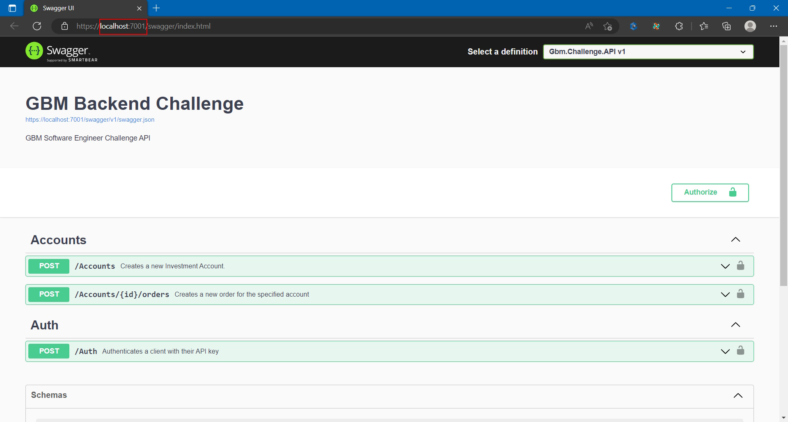

# GBM Software Engineer Challenge

This repository contains a solution developed as part of the GBM Software Engineer Challenge.
Please refer to the [instructions and requirements](./docs/Back%20End%20Challenge.pdf) for more details.

$~$

## Overview

The solution implements a [Clean Architecture](https://learn.microsoft.com/en-us/dotnet/architecture/modern-web-apps-azure/common-web-application-architectures#clean-architecture) using [CQRS Pattern](https://learn.microsoft.com/en-us/azure/architecture/patterns/cqrs), [MediatR](https://github.com/jbogard/MediatR), [Repository Pattern with Entity Framework](https://learn.microsoft.com/en-us/dotnet/architecture/microservices/microservice-ddd-cqrs-patterns/infrastructure-persistence-layer-implementation-entity-framework-core) and [Options Pattern](https://learn.microsoft.com/en-us/aspnet/core/fundamentals/configuration/options), this will have the benefit of easier maintainability and evolution of the app.

The solution is [Containerized using Docker](https://github.com/dotnet-architecture/eShopModernizing/wiki/02.-How-to-containerize-the-.NET-Framework-web-apps-with-Windows-Containers-and-Docker) with Linux containers, so it's ready to be included in a broader [Microservices Oriented Solution](https://learn.microsoft.com/en-us/dotnet/architecture/microservices/multi-container-microservice-net-applications/microservice-application-design) and as part of a [Deployment Pipeline](https://learn.microsoft.com/en-us/dotnet/architecture/devops-for-aspnet-developers/cicd).

$~$

## Implementation Highlights

In the _Duplicated Operation_ business rule, the requirement is not explicit about the comparison of the Operation Type, however it's being included in the current implementation, as a buy operation cannot be considered duplicate with a sell operation.

In the _Closed Market_ business rule, there's no explicit reference to any specific timezone, so no timezone is currently being used for comparison.

In case of multiple operations with the same issuer name, the issuer information is being repeated, probably they should be grouped, however the requirement is not clear about what grouping criteria to use. The problematic field would be _share_price_, as we can have operations with the same issuer name but different share price. A business decision is required here.

Regarding the JSON serialization, a couple of custom policies are being used. One in order to comply with the snake case specification, and the other to automatically convert to uppercase the enums serialization. 

Also, a custom JSON converter was introduced in order to parse UNIX timestamps into DateTime instances at binding time, and a custom Epoch was implemented as per the [UNIX timestamp specification](https://unixtime.org/).

Observability is of high importance when working with microservices, so logging was implemented using Microsoft Extensions Logging. At this point these logs are only visible to the console, but they can be plugged into Azure App Insights, Kibana or any other monitoring tool.

Even though Authentication and Authorization were not part of the original requirement, best practices dictate that all APIs must be secured. The use of [JWT tokens](https://blog.logrocket.com/jwt-authentication-best-practices/) is a defacto standard for this purpose and the implementation in this solution. For this purpose a Seed method was created in order have a set of test clients with their respective API keys to simulate they were granted by a third party and we just need to validate them. An _auth_ endpoint was created in order to acquire bearer tokens.

Documentation is generated using the [OpenAPI Specification and swagger](https://swagger.io/resources/open-api/), more details of this on the next sections.

In order to comply with the requirement to support regression tests, a set of integration test were created to validate all the Business Rules.

$~$

## Prerequisites

* .Net 6.0
* Visual Studio 2022
* Docker (optional)

The solution is based on .Net 6.0 and this decision revolves around the fact that it's an [LTS version](https://dotnet.microsoft.com/en-us/platform/support/policy) of .Net

The use of Docker is optional as you can build and run the solution locally in the context of Visual Studio (see [Build and Run](#build-and-run)).

$~$

## Build and Run

Once the repository has been cloned on your local computer, there are at least two options to build and run the solution.

### Using Visual Studio

* Using Visual Studio 2022 open the solution _Gbm.Challenge.sln_ on the _src_ folder.
* Go to Solution Explorer, right click on the Gbm.Challenge.API project and select Build.
* Once the solution is finished building, go to the Debug menu and select Start Debugging or just hit F5.

This will open up a browser (on port 7001) with the OpenAPI documentation where you can acquire a token and start testing the endpoints, or you can test this same behavior by using other tools like Postman.

**Important**

This approach requires the LocalDb feature to be installed on your system, if you already have Visual Studio, you most probably have it already installed, otherwise you can add it as an Individual Component with Visual Studio Installer.

### Using Docker

* Make sure Docker is up and running
* Using your preferred terminal navigate to the _src_ folder
* Run the following command: `docker-compose up -d --build`
* Once the build finishes, open a browser and navigate to this URL: [http://localhost:8001/swagger/index.html](http://localhost:8001/swagger/index.html)

If this is the first time you run the solution with this approach it can take some minutes to complete as this will download the required container images before building the solution, please be patient.
On subsequent executions you can just use the command `docker-compose up -d`

Please note that this URL is different than the one we saw when running from Visual Studio, this is the best indicator that we're running inside a container.

In this case LocalDB is not required at all, the database is created using the SQL Server 2019 image from the docker hub.

$~$

## Potential Enhancements

* Add a stock catalog to have a list of valid issuer names and verify at order creation time.
* Add a business operation timezone to the app settings to use on the _Closed Market_ business rule.
* In the _current_balance_ node, group the _issuers_ by _issuer_name_ and calculate the weighted average price per share.
* Associate every operation with the current client.